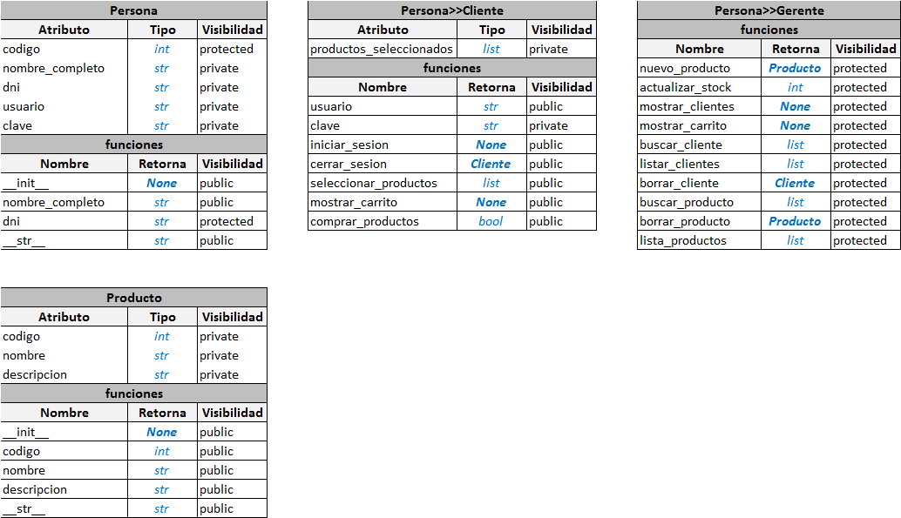
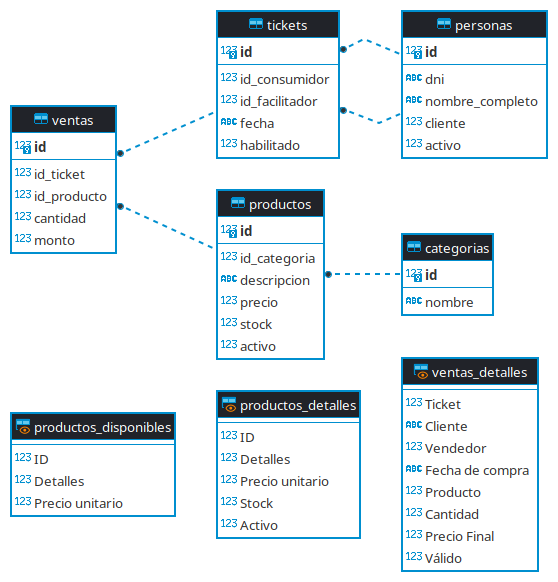
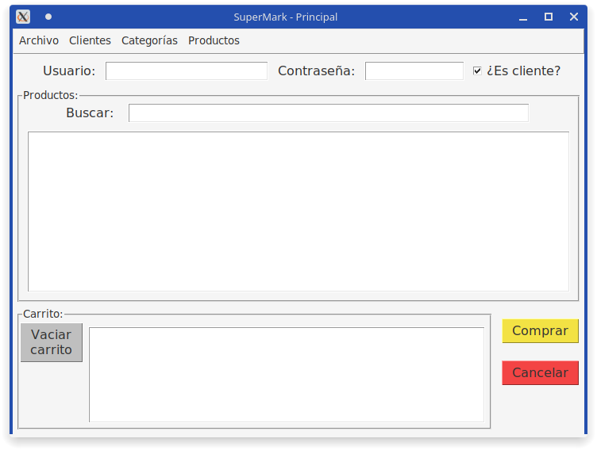

# supermark

## Sistema desarrollado en python para el curso "1000 programadores salteños"

El sistema escogido unánimemente fue el [supermark](docs/Proyecto_SG_Supermark-_Com_MyJ-Python-2022.docx__22__0.pdf).

## Checkpoint # 1

### Diagrama de clases:

Nota: Persona>>Cliente denota que la clase Cliente extiende a la clase Persona, además las funciones y atributos se omiten visualmente en la clase hija.

## Checkpoint # 2

Sistema de Gestión de Base de Datos (DBMS) escogido para trabajar: [SQLite3](https://www.sqlite.org/index.html).

### Diagrama Entidad Relación:

Diagrama realizado con [DBeaver](https://dbeaver.io/).

# Interfaz gráfica de usuario:

### Ventana Principal:

### Barra de Menús:

## Notas:

- Las tablas sin relaciones, son tablas temporales (Vistas) o que solo existen en una consulta.
- [Archivos de Respaldo](src/backup).
- [Script SQL (SQLite3)](src/supermark.sql) y [base de datos SQLite3](src/backup/supermark.db) (Estructura); [base de datos SQLite3 cargada](src/supermark-data.db) (Estructura y datos precargados).

## Integrantes:

- [Víctor Manuel Márquez](https://github.com/victorManuelMarquez)
- [Lucas Martin Aramayo Tapia](https://github.com/LTapia2501)
- [Moya Montero Matias Exequiel](https://github.com/Mmoya123)
- [Luz Milagros Gomez Rivera](https://github.com/luzzgomez) 
