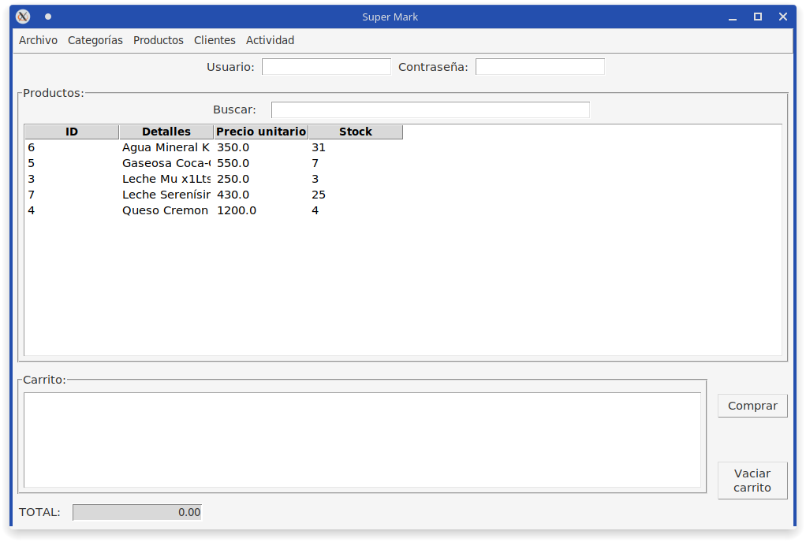

# supermark

## Sistema desarrollado en python para el curso "1000 programadores salteños"

El sistema escogido unánimemente fue el [supermark](docs/Proyecto_SG_Supermark-_Com_MyJ-Python-2022.docx__22__0.pdf).

## Checkpoint # 1

### Diagrama de clases:

Nota: Persona>>Cliente denota que la clase Cliente extiende a la clase Persona, además las funciones y atributos se omiten visualmente en la clase hija.

## Checkpoint # 2

Sistema de Gestión de Base de Datos (DBMS) escogido para trabajar: [SQLite3](https://www.sqlite.org/index.html).

### Diagrama Entidad Relación:

Diagrama realizado con [DBeaver](https://dbeaver.io/).

#### Detalles:

- Las tablas que aparentar estar "sueltas" son vistas; Para este sistema se utilizan como soporte para operaciones complejas.

# Interfaz gráfica de usuario:

### Ventana Principal:

#### Detalles:

Resolución por defecto 990x600 (debido a problemas visuales con la tabla)

### Barra de Menús:

> En futuras actualizaciones se planea agregar, al menú de 'Archivo', las opciones de gestión de la base de datos (crear, migrar y/o hacer un backup).

## Base de datos:

- [Script SQL (SQLite3)](src/supermark.sql) y [base de datos SQLite3](src/backup/supermark.db).

## Problemas:

- El "login" está incompleto (no puede cerrar sesión sin salir del programa). Además una nueva "sesión" redefine a la anterior.

- El "cliente" tiene dinero infinito, o sea falta algo que simule una compra/venta "real".

- No existe validación de las entradas en todos los campos.

- Se hace uso de un slider para navegar entre registros (lo que será un problema con una base de datos más poblada).

- No se puede usar una consulta almacenada para reforzar la integridad de los datos.

- No hay una validación adicional del lado del servidor (triggers diseñados para parar las consultas en caso de ser necesario).

- No se puede eliminar un item en concreto del carrito.

## Bugs:

- Un diálogo estándar o messageBox aparecerá por detrás de un diálogo modal.

> 

- El diálogo de ventas es muy pequeño en relación a la tabla.

- Las tablas suponen un problema al mostrar varias columnas.

## Integrantes:

- [Víctor Manuel Márquez](https://github.com/victorManuelMarquez)
- ~~[Lucas Martin Aramayo Tapia](https://github.com/LTapia2501)~~
- ~~[Moya Montero Matias Exequiel](https://github.com/Mmoya123)~~
- ~~[Luz Milagros Gomez Rivera](https://github.com/luzzgomez)~~
