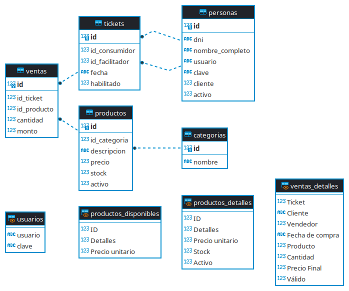

# supermark

## Sistema desarrollado en python para el curso "1000 programadores salteños"

El sistema escogido unánimemente fue el [supermark](docs/Proyecto_SG_Supermark-_Com_MyJ-Python-2022.docx__22__0.pdf).

## Checkpoint # 1

### Diagrama de clases:

Nota: Persona>>Cliente denota que la clase Cliente extiende a la clase Persona, además las funciones y atributos se omiten visualmente en la clase hija.

## Checkpoint # 2

### Diagrama Entidad Relación:

Diagrama realizado con [DBeaver](https://dbeaver.io/).

Nota: Las tablas sin relaciones, son tablas temporales o que solo existen en una consulta.

[Script SQL (SQLite3)](src/supermark.sql) y [base de datos SQLite3](src/supermark.db).

# Interfaz gráfica de usuario:

### Ventana Principal:

")

Nota: la apriencia de algunos de los componentes puede variar según el sistema operativo, en este caso son del S.O Linux Debian 11 "Bullseye".

Interfaz gráfica realizada con [Visual TK, Visual Python Tkinter GUI creator](https://visualtk.com/).

### Integrantes: [Víctor Manuel Márquez](https://github.com/victorManuelMarquez), [Lucas Martin Aramayo Tapia](https://github.com/LTapia2501), [Moya Montero Matias Exequiel](https://github.com/Mmoya123), [Luz Milagros Gomez Rivera](https://github.com/luzzgomez) 
